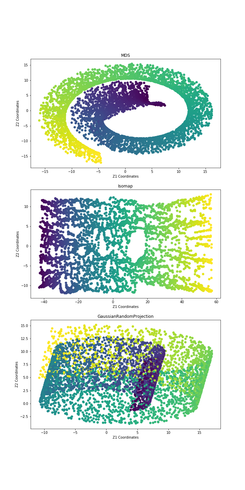
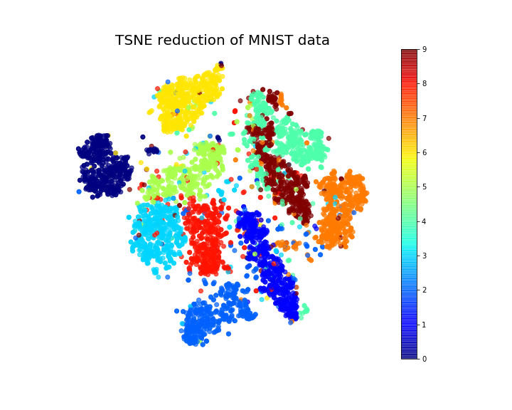

# dimensionality-reduction-notebook
*This project contains a notebook with many dimensionality reduction algorithms. This notebook is heavily inspired by 'Hands-on Machine Learning with Scikit-Learn, Keras and TensorFlow' authored by GeÌron, Aureìlien.*

### Algorithms
* Multidimensional Scaling (MDS)
* Isospace
* t-Stochastic Neighbors Embedding (t-SNE)
* Linear Disciminatory Analysis (LDA)
* Random Projection 
* Principal Component Analysis (PCA)
* Incremental PCA
* Kernel PCA (KPA)
* Optimizing KPCA
* Locally Linear Embedding (LLE)

### Algorithms in Action 
<section style="display:flex; flex-direction:column;">
  <article>
    <h4>Swiss Roll Two Dimensions<h4/>
    
  <article/> 
  <article>
    <h4>PCA Swiss Roll<h4/>
    
  <article/> 
  <article>
    <h4Incremental PCA<h4/>
    
  <article/> 
  <article>
    <h4>ExplainedVariance<h4/>
    
  <article/> 
  <article>
    <h4>Locally Linear Embedding<h4/>
    
  <article/> 
  <article>
    <h4>Multidimensional Scaling<h4/>
    
  <article/> 
  <article>
    <h4>Swiss Roll Two Dimensions<h4/>
    
  <article/> 
  <article>
    <h4>Reconstructions<h4/>
    
    
  <article/> 
  <article>
    <h4>Swiss Roll Two Dimensions<h4/>
    
  <article/> 
  <article>
    <h4>Swiss Roll Two Dimensions<h4/>
    
  <article/>
  <article>
    <h4>Swiss Roll Two Dimensions<h4/>
    
  <article/>
      

      
  
  
<section/>

### Sources 
1) GeÌron, Aureìlien. 2019. Hands-on Machine Learning with Scikit-Learn, Keras and TensorFlow: Concepts, Tools, and Techniques to Build Intelligent Systems. 2nd ed. CA 95472: O’Reilly.
